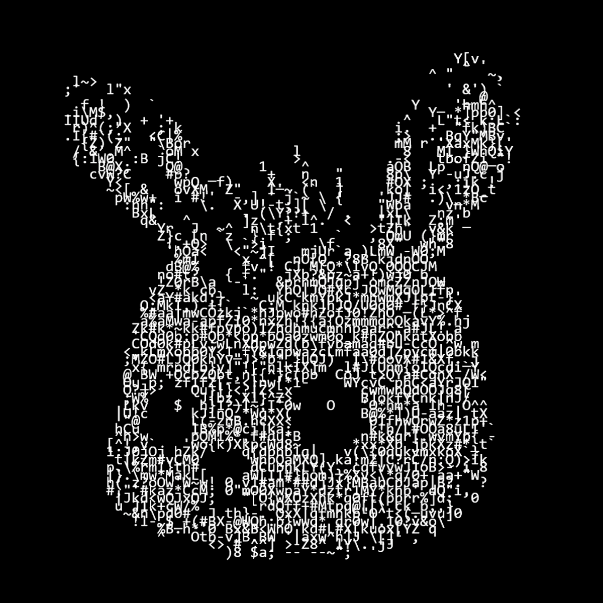

# Ascii-ART



### ¡Convierte imágenes en arte ASCII!

Ascii-ART es una aplicación moderna y visualmente atractiva para transformar cualquier imagen en arte ASCII, con soporte para colores, descarga y personalización avanzada.

Hecho con ♥ por Danii.

---

## 🚀 Características

- Conversión instantánea de imágenes a arte ASCII.
- Soporte para colores originales y paletas personalizadas.
- Descarga tu arte como imagen o archivo de texto.
- Ajusta resolución, contraste, brillo, tipo de caracteres y más.
- Interfaz moderna.
- Modo oscuro y diseño responsive.
- Integración con Tauri para versión de escritorio.

---

## 🖼️ Ejemplo


---

## ✨ ¿Cómo funciona?

1. **Sube una imagen** (JPG, PNG, etc.).
2. Ajusta los parámetros a tu gusto: resolución, caracteres, colores, brillo, contraste...
3. ¡Mira la magia! Tu imagen se convierte en arte ASCII en tiempo real.
4. Descarga tu creación como imagen o texto y compártela con el mundo.

---

## 📦 Descargas

### Aplicación Web  
[ascii-art.vercel.app](https://ascii-art-zeta.vercel.app/) — ¡Úsala directamente desde el navegador!

### Versión de Escritorio Windows

- 🔹 [Portable (.exe)](https://github.com/00Danii/Ascii-ART/releases/download/windows-portable/Ascii-ART.exe)
- 🔹 [Instalador (.exe)](https://github.com/00Danii/Ascii-ART/releases/download/windows-exe-instalador/ascii_art_setup.exe)
- 🔹 [Instalador (.msi)](https://github.com/00Danii/Ascii-ART/releases/download/windows-msi-instalador/ascii_art.msi)

> Puedes encontrar todas las versiones en la sección de [Releases](https://github.com/00Danii/Ascii-ART/releases).

---

## 🛠️ Instalación y uso (modo desarrollo)

### Requisitos

- Node.js 18+
- pnpm, npm o yarn
- (Opcional) Rust y Tauri para generar la app de escritorio

### Instalación

```bash
git clone https://github.com/00Danii/ascii-art.git
cd ascii-art
npm install
npm run dev
